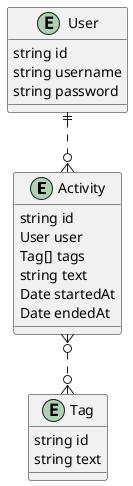

# Entities

```plantuml
@startuml
entity Activity {
  string id
  User user
  Tag[] tags
  string text
  Date startedAt
  Date endedAt
}

entity User {
  string id
  string username
  string password
}

entity Tag {
  string id
  string text
}

User ||..o{ Activity
Activity }o..o{ Tag
@enduml
```
