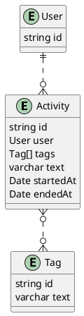

# Entities

```plantuml
@startuml
entity Activity {
  string id
  User user
  Tag[] tags
  varchar text
  Date startedAt
  Date endedAt
}

entity User {
  string id
}

entity Tag {
  string id
  varchar text
}

User ||..o{ Activity
Activity }o..o{ Tag
@enduml
```
